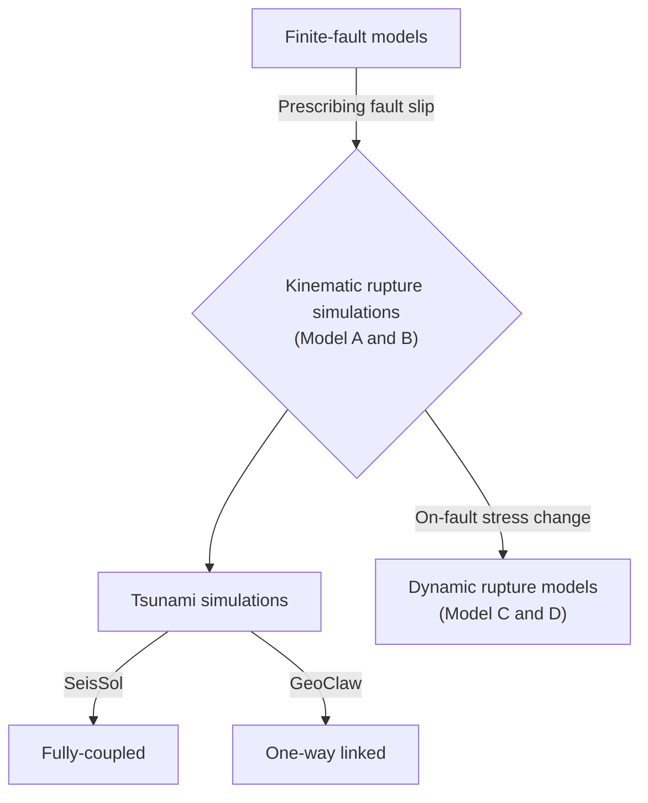

# 3D fully-coupled earthquake-tsunami modeling of the 2020 Mw 7.0 Samos earthquake

This repository contains supplementary material and input files for the MSc thesis of Fabian Kutschera.

Open-source software was used for the earthquake-tsunami modeling:

- SeisSol, version: 202103_Sumatra-1139-g00bbf63e, available from https://github.com/SeisSol
- GeoClaw, version: 5.9.0, available from https://github.com/clawpack

Please cite accordingly: 

<h2 style="text-align: center;">Flowchart</h2>

